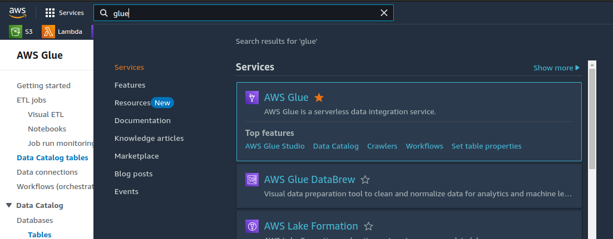
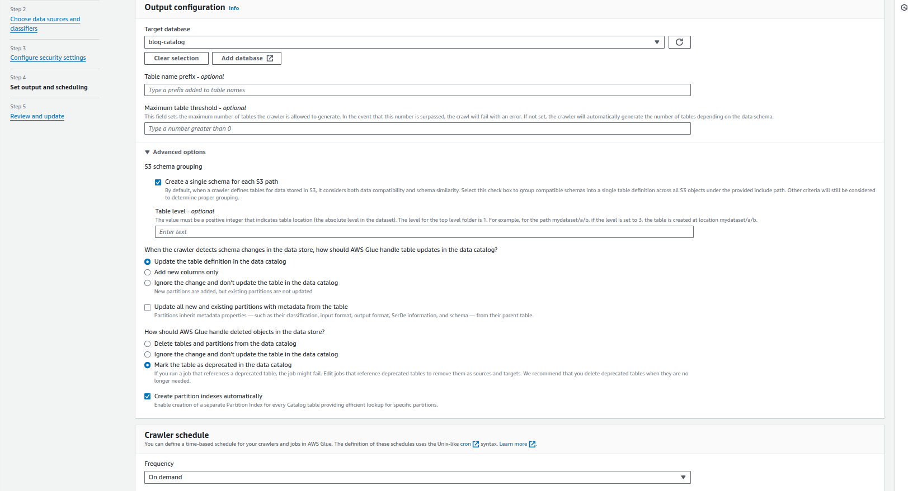
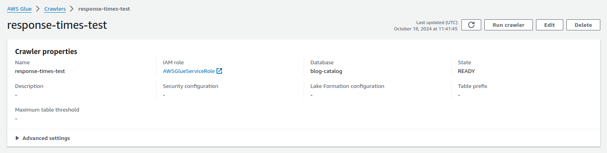

# Log Analytics with SQL?!?

I was talking to a friend recently and she happens to be a performance test engineer. It had been a stressful day for her because it took her an entire day to analyse some performance results. You might be wondering:

> Sure, it takes time actually running performance tests but how can it take an entire day to analyse the results?

Well, I have to admit that the "taking the entire day" part is a bit of an exaggeration on my part. But it was taking way more time than it should have. Let me explain how.

The project she's working on, is a multi-tenant, multi-user setup where each tenant "owns" multiple IoT devices. Since those tenants mostly have geographically distributed edge devices, each edge-device in a particular geographical region sends communicates with the tenant via "regional nodes". In our context, that means each regional node collects logs from the edge devices in its scope, combines them, and sends them down to the tenant.

Here's how I imagined it so I hope it makes sense for all of you:


Here's the scenario my friend had to target:

- Edge devices poll for highly specific content, which is always `1048000` bytes in size
- For each polling request, an edge device logs the response size and response time
- These logs are being sent to the corresponding regional node
- Each regional node is configured to send back these logs (in csv format) to the tenant in batches

Enough with the details of the flow. Let's move on to what my friend actually had to test- concurrent polling requests from edge devices all over the world, to a specialized API.

After many consideration that are out of scope for this blog, her team put together the a distrubuted test setup on AWS infrastructure, to imitate this behavior.

They're now using:
- EC2 instances representing regional nodes
- Docker containers, running in each EC2 instance, representing edge devices
- Each Docker container starts up with a script to make an `n` number of polling requests to the API server, record the response size and time, and provides them to their host instance
- Each EC2 instance, in return, uploads these logs to a shared S3 bucket.
<br/><br/>


After the test, our S3 bucket has supposedly hundreds of csv files that look like this:

```csv
response_size,response_time
1048000,533.92
1048000,548.34
1048000,527.13
1048000,544.23
1048000,580.05
1048000,570.71
...
...
...
```

If you're still here reading my blog, I have successfully managed to build up the scenario for you and you deserve to know the problem statement. So, here's what my friend's boss asked her to do with the test results:

> Given these several hundred files with identical schemas, calculate the average response time for a successful polling request to the API server.

If this were me, open each file in Excel, calculate the average and then calculate the cummulative average from within all the files. My friend, however, is smarter and she knows how to make her life simpler so here's what she does:

- Run a script to download all objects from the S3 bucket into a folder
- Run another script to combine all csv files into one giant csv file
- Run an Excel formula to calculate the average response time ONLY for the records that have a response size of exactly `1048000` bytes.

With my brand-new AWS knowledge and eagerness to put some of my data engineering skills to test, I decided to make her life even simpler for her.

By the way, did you know you can query data from within "objects" using SQL? Well, I didn't but I guess you learn something new everyday.

Before we jump into the AWSy solution, let me introduce you to a service that I also just discovered while developing my solution, and that is... Apache Hive.

> Apache Hive is a data warehouse software project. It is built on top of Apache Hadoop for providing data query and analysis. Hive gives an SQL-like interface to query data stored in various databases and file systems that integrate with Hadoop. Apache Hive supports the analysis of large datasets stored in Hadoop's HDFS and compatible file systems such as Amazon S3 filesystem and Alluxio. It provides a SQL-like query language called HiveQL with schema on read and transparently converts queries to MapReduce, Apache Tez and Spark jobs. 

Wow! Just wow! Honestly, those guys on LinkedIn who go around saying "SQL is used everywhere" are not wrong. Apache Hive is open-source software which is literally made to provide a central querying interface for transactional databases as well as traditional file stores. So, wherever there's a schema, Hive can let you query data using SQL, or as I should say- HiveQL.

Now that we've taken a moment to appreciate Hive, let's stop pretending that AWS doesn't sponsor my entire life and move on to their solution.

In all seriousness though, deploying hive isn't an easy task and requires strong operational overhead. It's wouldn't be cost effective for a scenario like ours. So, what would be cost-effective? Is it something named after a Greek goddess with infinite wisdom?

Yes! It's Amazon Athena! It's absolutely crazy to think that just a month ago, I didn't even know this service existed and now I advocate it to everyone, from colleages at work to my 60 year old grandfather who just learnt how to `SUM` a column in Excel. It's for good reason though. Athena is a serverless, fully managed service from AWS, that allows you to query your S3 buckets and Glue catalogue databases, using SQL. And no, we're not talking about some modified version of SQL called HiveQL or AthenaQL. Athena allows you to use traditional SQL- the one we all know and love!

Okay, so I feel like this has gotten too much so let's move on to how Athena is helping me help my friend. We already have an S3 bucket with countless files containing possibly millions of records right? Well, we can use another AWS service called Glue, to create a "crawler", that will literally go through the entire S3 bucket, infer each file's schema itself and create tables for all schemas. Let's do it!

Sorry. Before diving in, let's take a quick look at the architecture we're targetting.


Alright, now let's dive into the AWS Console and search for Glue.



Now, let's click on `Crawlers` under the `Data Catalog` section of the Glue console.


Click on `Create Crawler` in the top right.


Let's go through the process of creating our crawler:

### Step 1 - Crawler Properties
Configure the name, description and tags for your crawler


### Step 2 - Data Source
Configure the data source for the crawler i.e. our S3 bucket. As for the configuration, since we know that all our data follows a fixed schema, we can manually create a Glue catalog table to map our crawler to. However, to fully demonstrate the capabilities of our crawler (which is inferring schemas from the files themselves), we'll go with `Not yet` and we'll add our S3 bucket (or folder) as a data source.


### Step 3 - Configuring Crawler Security
First off, we need to create a Glue service role and assign it to the crawler for it to work. On this page, we can also configure encryption at rest for the Cloudwatch logs pushed by our crawler but there's no need for that in our use case.


### Step 4 - Crawler Output Configuration
This part is important so let me break it down for you:

- First, we need to tell the crawler which Glue catalog database to add new tables to/update tables in. I already have one but incase you don't, you can click on the `Add Database` option and move forward with these steps once your database is ready.
- Then, we need to tell the crawler to group together all files that follow a similar schema into a single table. This is probably the most IMPORTANT configuration for our use case since we want to aggregate the results from multiple files.
- Finally, we set the schedule frequency to `On Demand`. Since these crawlers mostly work together with ETL pipelines, Glue gives you the option to run crawlers as cron jobs. However, since we just want our table to be updates when we run a test, we set it to `On Demand`.



Once we're done reviewing our details, we can proceed with the creation of the crawler, where we're taken to that crawler. To run the crawler, we can click on `Run Crawler` on the top right.



<hr/>

Once our crawler has successfully crawled the S3 bucket, you will be able to see the status `Completed` for the latest run in the `Crawler Runs` section.


Now, we should be good to go and query our logs using Athena! However, before moving, we need to confirm if our crawler was successful. To do this, we can click on `Tables` under the `Data Catalog` section of the Glue console.


One last thing we can do before moving on is to check if our crawler inferred the schema correctly. To do this, we can click on the table and check the `Schema` section. And viola! The deed is done. We have `response_size` and `response_time` as queryable attributes.


Well that took quite a few clicks didnt it? I would say it took about as much effort as my friend puts into combining files and then querying them in Excel, everytime she runs a test. However, the good thing about this setup is that it only has to be done once. Now that we've created our crawler, my friend only needs to run it everytime she runs her tests and she's good to go.

Oops. I almost forgot the querying part. Off to Amazon Athena!


And... Here it is! Our query editor.


We make sure that `AWSDataCatalog` is selected as the Data source and our Glue catalog database is selected as the Database. Now, my friend can run a query as simple as

```sql
SELECT AVG(response_time) AS average_response_time
FROM "blog-catalog"."responses"
WHERE response_size = 1048000;
```

to analyze her test results!


Or maybe, she could run the following to also get a count for the number of records that account for the average value:

```sql
SELECT
    COUNT(*) as successful_responses,
    AVG(response_time) AS average_response_time
FROM "blog-catalog"."responses"
WHERE response_size = 1048000;
```

## Conclusion
Now that you've seen how powerful AWS Glue and Amazon Athena are, when paired up together, I'm sure you'll also utilize them for basic log aggregation.

Honestly, the use cases of these services are endless and go far beyond going over logs that have 2 attributes and calculating the average. Both Glue and Athena are probably the most-used cloud services by data engineers for big data processing.

Glue allows you to create, schedule and run ETL jobs on the go, without having to manage the overhead of Spark clusters. Athena, while maybe not as powerful as Hive, gives you a major chunk of Hive's functionality while allowing you to focus more on data engineering than managing the infrastructure. Also, did I mention that Athena integrates with existing Hive clusters like jam and bread?

I just started my journey as a data engineer a few months ago and honestly, there's so much to learn. AWS has made it easier for me to focus more on learning data engineering concepts than to worry about setups and troubleshooting installation failures. So, if you're also someone like me- looking to get into the fascinating world of big data, I'd definitely recommend having AWS managed services as your goto!